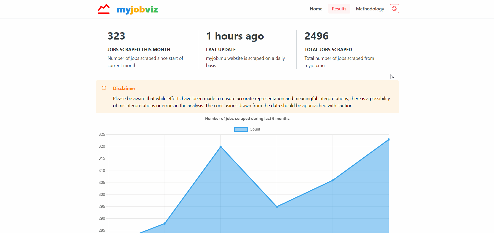

# myjobviz  

  

Visualize the latest job trends in the IT job market in Mauritius. 

[▶ Live preview](https://myjobviz.web.app/)

> 🔴 **Note**: Please be aware that while efforts have been made to ensure accurate representation and meaningful interpretations, there is a possibility of misinterpretations or errors in the analysis. The conclusions drawn from the data should be approached with caution.
## How it works

1. A selenium web scraper fetches new jobs from `myjob.mu` on a daily basis.
2. Scraped data is processed and saved to Firestore database.
3. `myjobviz` website fetches processed data from Firestore and creates charts.

## Installation

View instructions on how to setup the project locally [here](docs/setup.md).

## To-do 
* [ ] Add more workflows
  * [ ] backup database.
  * [ ] check for duplicates.
  * [ ] Connect firebase to github for automatic deploy
* [ ] Add error handling on frontend if data missing from database.
* [ ] Update `rebase_stats` to automatically delete all fields.
* [ ] Find solution: `job_title_data` could exceed 20,000 fields limit.
* [ ] Add more tests using test sample data.
* [ ] Frontend
  + [ ] Add a choropleth map
  + [ ] Add PWA support
* [ ] Use typescript on frontend
* [ ] Generate a weekly report and send by email
* [ ] Improve website performance & SEO
* [ ] Generate charts on backend

## Acknowledgements

Project was inspired by the [Stack Overflow Developer survey](https://insights.stackoverflow.com/survey).
