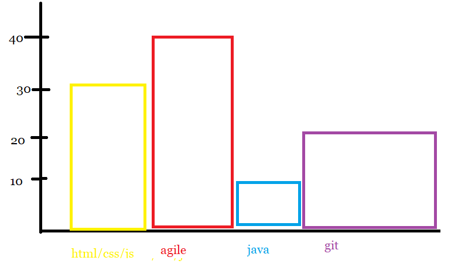

# Job-Portal-Web-Scraper
A web scraper for MyJobs.mu that checks the requirements of a particular job. For example, 
- Look at all the ‘software developer’ jobs present in a job portal
-  Analyze the job requirements 
-  Plot a graph of frequency for each requirement using `graph` in python. 
  
 - Create a Top 10 skills in demand in Mauritius.
 - Create a pandas dataframe out of scraped data + maybe  use Jupyter Notebook

