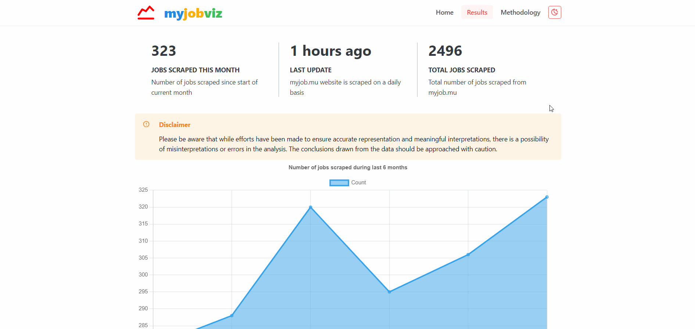

# myjobviz  

  

myjobviz is a data visualization platform that analyzes and presents trends from IT job postings in Mauritius. The application automatically scrapes job data, processes it to extract meaningful statistics, and presents insights through interactive charts and graphs.



[🌐 Live Demo](https://myjobviz.web.app/) | [📖 Setup Guide](docs/setup.md) | [📊 Dataset on HuggingFace](https://huggingface.co/datasets/goated69/mauritius-it-jobs)

## Dataset

The complete dataset of scraped IT job postings is available on HuggingFace: **[Mauritius IT Jobs Dataset](https://huggingface.co/datasets/goated69/mauritius-it-jobs)**.

## Features

- **Automated Data Collection**: Daily scraping of IT job postings from myjob.mu
- **Comprehensive Analytics**: Track trends in technologies, job locations, salary ranges, and more
- **Interactive Visualizations**:
  - Line charts for historical job trends
  - Pie charts for job locations and salary distributions
  - Horizontal bar charts for technology stack analysis
  - Word clouds for job title keywords
- **Dark Mode Support**: Toggle between light and dark themes
- **Responsive Design**: Optimized for desktop and mobile devices

## How it works

```
┌─────────────────┐
│  myjob.mu       │
│  (Job Source)   │
└────────┬────────┘
         │
         │ Daily Scraping (Selenium)
         ▼
┌─────────────────┐
│  Data Processing│
│  & Statistics   │
└────────┬────────┘
         │
         │ Store Results
         ▼
┌─────────────────┐
│  Firestore DB   │
└────────┬────────┘
         │                │
         │ Fetch Data     │ Monthly Backup
         ▼                ▼
┌─────────────────┐  ┌──────────────────┐
│  myjobviz UI    │  │  HuggingFace     │
│  (React App)    │  │  Dataset         │
└─────────────────┘  └──────────────────┘
```

1. **Scraping**: A Selenium-based web scraper runs daily via GitHub Actions to fetch new job postings
2. **Processing**: Job data is analyzed to extract key statistics (technologies, locations, salaries, etc.)
3. **Storage**: Processed data is saved to a Firestore database
4. **Visualization**: The React frontend fetches data from Firestore and renders interactive charts
5. **Backup**: Dataset is automatically backed up to HuggingFace monthly for public access and research

## Disclaimer

While efforts have been made to ensure accurate representation and meaningful interpretations, there is a possibility of misinterpretations or errors in the analysis. The data reflects job postings from a single source (myjob.mu) and may not represent the complete IT job market in Mauritius. Conclusions drawn from the data should be approached with caution.

## Acknowledgements

Project was inspired by the [Stack Overflow Developer survey](https://insights.stackoverflow.com/survey).